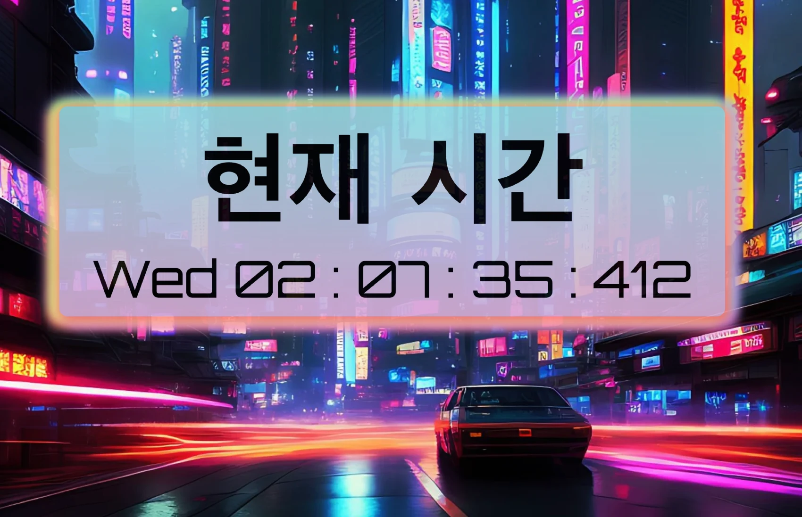

# BlueNight in Seoul Clock
The project creates a clock using JavaScript, HTML, and CSS to display the current time dynamically.

[🚀 jsohndata.github.io/bluenight-in-seoul-clock](https://jsohndata.github.io/bluenight-in-seoul)

 

## Homage
* [Blue Night in Seoul < Last Hope > - StarCraft Map](https://scmscx.com/map/G8V4Rh2D)

 

## Credit
* [Google Font: Orbitron](https://fonts.google.com/specimen/Orbitron?preview.text=10:11&preview.text_type=custom)
* [Fotor](https://www.fotor.com/)
* [CSS Gradient](https://cssgradient.io/)
* [CSS Box-Shadow](https://html-css-js.com/css/generator/box-shadow/)
* [Favicon](https://favicon.io/favicon-converter/)
* [toLocaleString](https://www.w3schools.com/jsref/jsref_tolocalestring.asp)